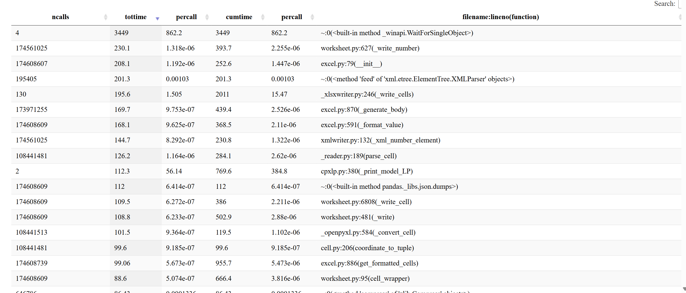

Ali Darudi wrote:

I tried out some fancy stuff I didn’t even know existed until basically yesterday — runtime profiling in Python. It lets you track exactly where the code spends its time during execution, and visualize it nicely (see screenshot below).

Here’s what stood out (for a run of 2050 only, resolution of 8 days):

- As expected, a big chunk of time goes into the Gurobi solver (\~57 min).
- But a surprisingly large chunk (\~30 min) is used just for exporting results to Excel — we’re writing \~175 million cells, one by one.
- Most of the export time is in formatting and per-cell write operations.

What this means going forward:

- We’ll get a major speedup if we write large datasets to CSV or HDF5 instead of Excel.
- If Excel is still needed, we should switch from writing individual cells to writing whole rows or blocks.
- We should also reduce how much we export, and limit formatting wherever possible.

Let’s take this as input for refining our output pipeline over time. Best, Ali

Below: 1) screenshot of tasks, ordered by tottime, 2) ChatGPT analysis of Excel part ...

### 1. Screenshot of tasks



### 2. ChatGPT analysis of Excel part

Excel Export: Core Bottlenecks These are all related to writing large amounts of data into an Excel file.

- worksheet.py:627(\_write_number)
```markdown
174M calls | 230.1s tottime | 393.7s cumtime
What: Writes a number to an Excel cell (XlsxWriter or OpenPyXL)
✅ Action: You're writing 174 million cells; reduce volume or write in batch
```

- excel.py:79(**init**)
```markdown
174M calls | 208.1s tottime | 252.6s cumtime
What: Creates a new Excel cell or style/format object
✅ Action: Avoid per-cell formatting or object instantiation
```

- excel.py:870(\_generate_body)
```markdown
174M calls | 169.7s tottime | 439.4s cumtime
What: Converts internal data to Excel row/cell layout
✅ Action: Structure export for batch row/column writing
```

- excel.py:591(\_format_value)
```markdown
174M calls | 168.1s tottime | 368.5s cumtime
What: Formats Python data types into Excel strings/numbers
✅ Action: Avoid writing mixed types or formatting per cell
```

- worksheet.py:6808(\_write_cell)
```markdown
CopyEdit 174M calls | 109.5s tottime | 386.0s cumtime
What: Final write to cell — applies formatting and writes value
✅ Action: Same as above
```

- worksheet.py:481(\_write)
```markdown
174M calls | 108.8s tottime | 502.9s cumtime
What: Low-level Excel cell write function
✅ Action: All worksheet.write() calls go here — consider write_row
```

- excel.py:886(get_formatted_cells)
```markdown
174M calls | 99.1s tottime | 955.7s cumtime
What: Retrieves final cell values after formatting
✅ Action: Cumulative time shows this is a major aggregation function; cut input volume
```